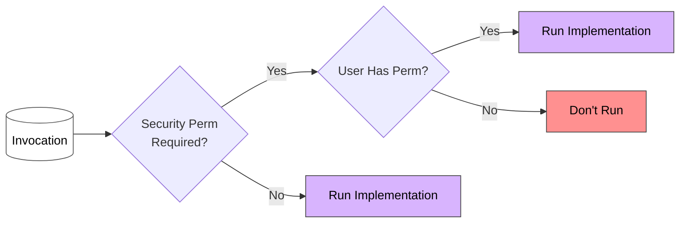
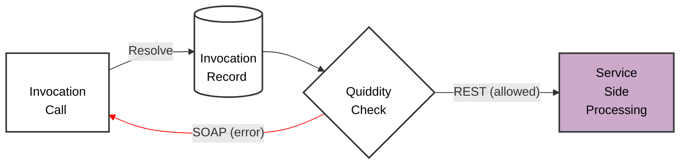

# Microscope Security

Microscope provides mechanisms to restrict when and by whom an Invocation or Service can be run, configured entirely in metadata with no code changes required.

## Restricting Invocations By Permission

The application can restrict the running of an Invocation to only those users with a custom permission assigned. This is achieved by having an *Invocation CMT record* with the *Security Permission* field populated.

*Security Permission* acts as a final gate in the candidate selection process. After the Release Permission and Invocation Permission checks identify a candidate Invocation record, the Security Permission is checked last. If the user does not hold the Security Permission, that candidate is skipped and the next candidate is evaluated. If no candidate passes the Security Permission check, an `UNPERMISSIONED_USER` error is raised. This can be logged in the Audit table to alert administrators that a user or application has attempted to access functionality they are not authorized to use.

For the complete multi-permission selection process, see [Invocation Permission Selection](InvocationPermissionSelection.md).

## Restricting Invocations By Context

The *Invocation CMT* field *Allowed Quiddity* restricts execution to only the intended execution contexts. This reduces the risk of misuse, whether caused by malice (hostile agents), human error or bad practice (e.g. calling a method written for an LWC controller from another Apex class). In particular, this adds an extra layer of security for endpoints exposed to the internet via a simple configuration setting.

For example, if *Allowed Quiddity* is set to `REST` then an `AURA` quiddity would be rejected.

The allowed quiddities should be defined during the Design phase and referenced in User Stories — it is a crucial part of the security design of the system. Wherever there is a clean subset of contexts from which an invocation can only ever be called, restrict execution to just those.

### Quiddity Reference

| Quiddity | Description |
|----------|-------------|
| AURA | Execution event is an Aura or LWC component. |
| BATCH_APEX | Execution event is a batch Apex job. |
| BULK_API | Execution event is a bulk API request. |
| FUTURE | Execution event is a future method. |
| INVOCABLE_ACTION | Execution event is an invocable action. |
| QUEUEABLE | Execution event is a queueable Apex operation. |
| QUICK_ACTION | Execution event is a quick action. |
| REMOTE_ACTION | Execution event is a remote action. |
| REST | Execution event is an Apex RESTful Web service. |

### Unit Test Quiddity Exemption

When *Allowed Quiddity* is populated, Microscope automatically permits the following quiddities in unit test contexts so that tests are not blocked by the restriction:

| Quiddity | Description |
|----------|-------------|
| RUNTEST_ASYNC | Execution event is Apex tests running asynchronously. |
| RUNTEST_DEPLOY | Execution event is Apex tests run during deployment. |
| RUNTEST_SYNC | Execution event is Apex tests running synchronously. |

## Exposing Invocations to External Systems

For Invocations that are deliberately exposed to inbound integrations, the boolean field **External_Invocation__c** should be set on the *Invocation CMT* record. This field:

- Provides a reportable flag so administrators and security officers can see all deliberately exposed invocations at a glance.
- Enforces a validation that *Allowed Quiddity* is also set. If it is not, Microscope's validation tooling raises a warning with error code `EXTERNAL_INVOCATION_NO_QUIDDITY`.

For an inbound REST integration, the recommended setup is:

1. Set *Allowed Quiddity* to `REST` (or `SOAP` as appropriate) so the invocation cannot be called from any other context.
2. Create a dedicated Custom Permission and assign it only to the Integration User. Populate *Security Permission* on the Invocation CMT record with this permission so that no other user account can trigger the invocation even if credentials are compromised.
3. Set **External_Invocation__c** to true to make the exposure visible and enforce the quiddity validation.

To prevent any invocation from being accessible externally, set *Allowed Quiddity* to only the internal contexts it requires (e.g. `AURA,QUEUEABLE`), excluding `REST` and `SOAP`. Any external attempt will be blocked with a `DISALLOWED_QUIDDITY` error.

## Restricting Services By Permission

Where invocation-level restriction controls access at the point of call, service-level restriction lets the **service owner** govern access to their entire service in one place. This is valuable for sensitive or privacy-critical services: rather than inspecting every invocation across the org to understand who can reach a service, the service team controls a single Custom Permission — all users assigned that permission can theoretically access the service, and no others can.

The **Service Permission** field on the *Service CMT* record specifies the Custom Permission a user must hold to invoke the service. If the user does not hold it, the request is blocked with error code `UNPERMISSIONED_USER_SERVICE` and the implementation is not run.

Key points:

- *Service Permission* applies to **all Method Iterations** on the service. If different methods require different permissions, create separate Services.
- Invocation-level and service-level permissions are **additive** — a user must satisfy both the invocation restrictions and the service permission to run an implementation.
- The Custom Permission should reside in the service owner's repository, keeping ownership clear.
