## Microscope Solution
 
The solution builds on established Enterprise delivery concepts such as service-oriented architectures, microservices, and dependency injection, and combines them with Salesforce Lightning Platform features to create a framework that is flexible enough to handle a wide range of Enterprise challenges. Through a single paradigm, it supports Salesforce DX adoption, packaging, technical debt avoidance and mitigation, build hygiene, multiple lines of business, regional variations, prompting, Agentforce Actions, appropriate governance, release management, pilots, A/B testing, concurrent versions, environment management, responses to Gen AI prompt safety breaches, safety testing and retesting assurance, standardized security behind exposed endpoints, team onboarding and mobility, build visibility, design quality, and full runtime audit and intelligence.

### Installation

Instructions for installing the package are [here](https://kevinhenryburke.github.io/microscope-pub/installation/MicroscopeInstallation). 

Microscope Skills, to aid AI Code Generation tools, can be downloaded from [here](https://kevinhenryburke.github.io/microscope-pub/downloads/microscope-skills). Follow the guidelines for your Coding Agent of choice for how to install these in your development environment (e.g. in a top-level *.claude* folder).

### Platform Features Utilized

The solution uses a combination of Lightning Platform features.

- Custom Metadata Types (*CMTs*) to define the structure of the production build and the mechanisms for special processing in *lower orgs* (scratch orgs and sandboxes).

- Custom Settings for temporary changes in production and to configure features that vary across environments. CMT records are the same across all test environments; Custom Settings are only used when environmental differences occur.**

- Custom Permissions to enable differences in processing for different groups of users.

- Custom Objects to capture runtime transaction information for auditing and to allow rerunning of transactions.

- Data 360 for long-term storage of audit records of user interactions.

- CRM Analytics for visualizations and reports of audit data and build structure.

- Platform Events for asynchronous communication between functional components and auditing services.

- Platform Cache to reduce calls to Custom Metadata and maintain high processing performance.

### Service Model

The framework is built around a configuration-driven service model using Custom Metadata Types.

At runtime the model works like this, details will follow:

1. A caller references an **Invocation Call** value. This value must be used only once in calling code across the org. The calling technique varies by technology.
    - In Apex the *Invocation Call* field is used as an input argument to a method that initializes an instance of a Service Invocation class.
    - In Flow the *Invocation Call* field is an input parameter to an Invocable Method
    - In OmniStudio tools the *Invocation Call* field is used as a map parameter.

2. The runtime framework uses this *Invocation Call* value to retrieve one or more related *Invocation* CMT records and depending on the running context, one is selected. *Invocation* CMT records can optionally reference custom permissions to provide different processing for different users (depending on the custom permissions they have assigned) which drives the selection of the correct *Invocation* CMT record. The full selection logic is described in [Invocation Permission Selection](../docs/InvocationPermissionSelection.md).

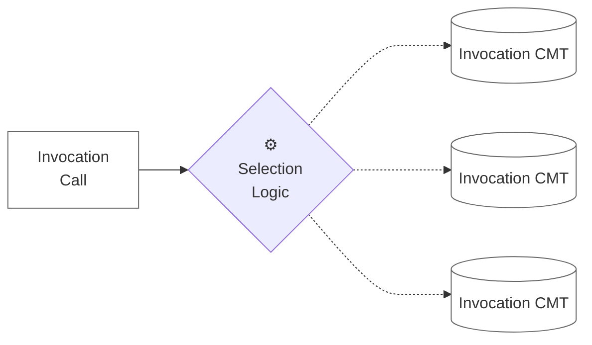

3. The selected *Invocation CMT* record contains fields such as *Service Name, Service Version, Method Name, Method Iteration,* and *Implementation Version*. Together, those values identify the target Service-side records.

4. Using the *Service-side* metadata, the framework resolves the correct *Implementation*, such as an Apex class or a Flow. 

5. The framework runs the self-contained implementation, which performs the business functionality, delegates to other applications or interacts with external systems like LLMs, and returns the result and status back to the caller. 

In the diagram below, the left-hand side is the **Invocation-side**. Engagement systems such as page components, Flows, and Agentforce Actions. The right-hand side is the **Service-side** which facilitates the business functionality.

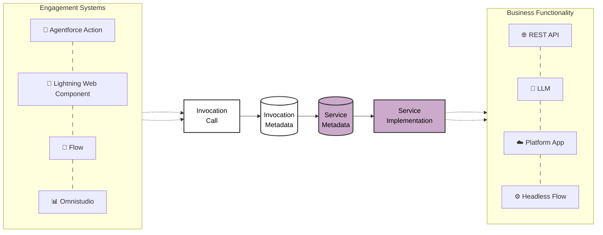

The Engagement systems on the left reference **Invocation CMT** records which abstract the business functionality from the caller. These CMT records reference 3 tiers of metadata on the *Service-side*.

  - High-level business capabilities are represented by **Service CMT** records. A Service might represent an external interface, abstract a large package, or encapsulate a custom platform capability developed by the Enterprise. 
  - The individual functions exposed by a Service are represented by **Method Iteration CMT** records. These records define the method **signature**, the input and output definitions.
  - **Implementation CMT** records point to what actually runs, such as an Apex class or a Flow. Each runnable artifact should be self contained with references to only the bare minimum needed to implement the functionality. 

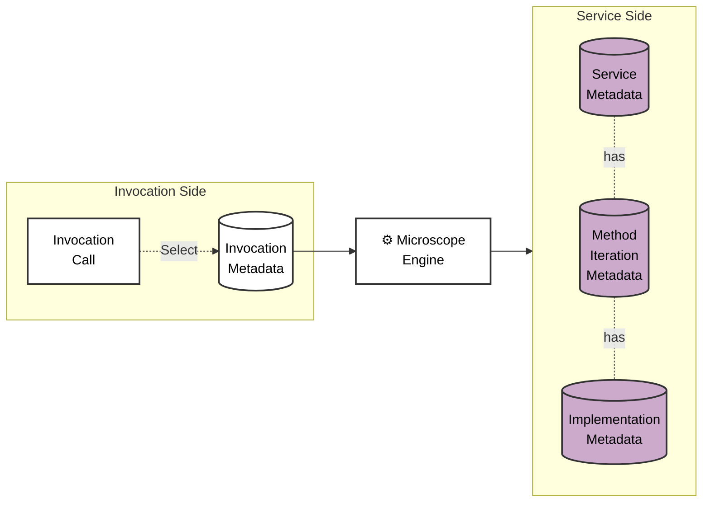

There are deliberately no direct lookup fields between the left-hand side and the right-hand side of the model. In development and test scenarios, teams may want to deploy an *Invocation CMT* record into a **partial-code** environment (like a scratch org) where the related Service-side CMT records are not yet present. Instead, the Service, Method, and Implementation names and versions on the *Invocation CMT* act as "soft" lookups. When the relevant Service-side records exist (as they always will in a **full-code** environment, i.e. one with the full Enterprise code-base installed), those values uniquely identify the Implementation CMT record to use. 

The section on [Invocation Permissions](#invocation-permission-based-processing) explains what can be done when the Service-side records are absent.

Invocations can run synchronously or asynchronously, using Platform Events or Queueables depending on the requirement. Throughout the process, the framework tracks *Invocation Details*. Errors are handled consistently as part of that same structure.

To avoid repeated queries, the Service-side field values used for an Invocation can be stored in Platform Cache for reuse. The cache is refreshed whenever an *Invocation CMT* record changes.

Invocations of Services may be composed by *embedding* a new call to an Invocation inside a Service Implementation, or by *chaining:* using the output of one or more Services as the input to another Invocation using Flows or Apex.

The Service Model is the foundation of the framework. It standardizes how invocations are made and how services are implemented across multiple platform technologies. Because the connections are controlled by metadata, they become visible and governable. Services also provide a layer of abstraction: they hide implementation complexity from callers, expose only what teams choose to expose, and let Enterprises apply their own business vocabulary over vendor capabilities. This reduces dependency coupling and helps limit vendor lock-in.

To implement these patterns, you can either run the relevant AI skills or check out the documentation that comes with the skills.

* **Setup a new Service method**: [AI Skill](../skills/microscope-new-method-setup/SKILL.md) | [Documentation](../skills/microscope-new-method-setup/README.md)
* **Setup a new caller-side Apex invocation**: [AI Skill](../skills/microscope-new-apex-invocation/SKILL.md) | [Documentation](../skills/microscope-new-apex-invocation/README.md)
* **Refactor an existing Apex method into a Service**: [AI Skill](../skills/microscope-refactor-method/SKILL.md) | [Documentation](../skills/microscope-refactor-method/README.md)

### Visibility

The framework provides visibility into how parts of the org are connected, via CMT configuration objects, and how the org is used, via Audit records. This feeds into both structural analysis, which is useful for delivery teams and code generation, and usage analysis, which is useful for business intelligence and AI grounding.

Both Structural and Usage data items can be easily uploaded to Salesforce Data 360 and CRM Analytics using configuration-only tooling.

#### Structural Analysis Insights

Making connections visible in an org through Invocation and Service-side metadata provides clarity on how changes should be implemented and gives delivery teams a common vocabulary.

- Configuration metadata gives a view of all the invocations and related implementations in the org, increasing understanding of the org’s current state for teams involved in delivery.

- High Level functional visualizations allow analysts and architects to add details about implementations to their designs to ensure that the build matches the design.

#### Audit and Errors

Every runtime invocation creates an **Invocation Details** object instance. It captures information about the invocation, including data derived from the Invocation and Service-side CMT records, plus runtime values such as the current user, the Custom Permission that allowed the invocation, execution context, and timestamps. The framework passes *Invocation Details* into the implementation, which can enrich it with additional data such as processing context or the final Success or Failure status. A standard error structure is part of *Invocation Details* and is populated consistently in both Flow and Apex.

The *Invocation CMT* can instruct the framework to save *Invocation Details*, together with serialized input and output data, to a custom object named **Audit**. This can happen at two points: when the invocation starts, and after the implementation finishes. Audit can run either synchronously, with records saved in the same transaction, or asynchronously.

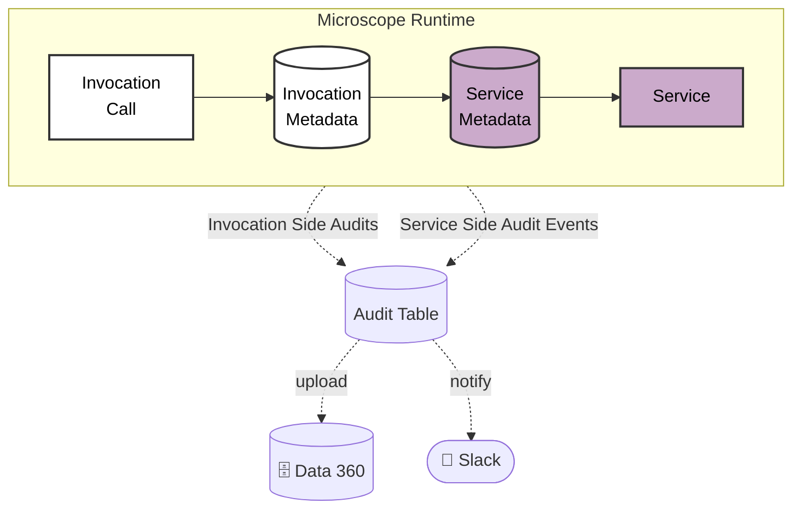

The framework's transaction audit has a simple, flat structure that is well suited to error detection, alerting, and upload into analytics platforms. It also supports multi-level auditing of related invocations. If one parent invocation runs an embedded child invocation inside its Service implementation, the child's audit record links back to the parent, providingi an **Invocation Call Stack**.

Invocations may be **rerun** from the Audit Table by using the *Invocation Details* and the serialized input data to recreate the original invocation.

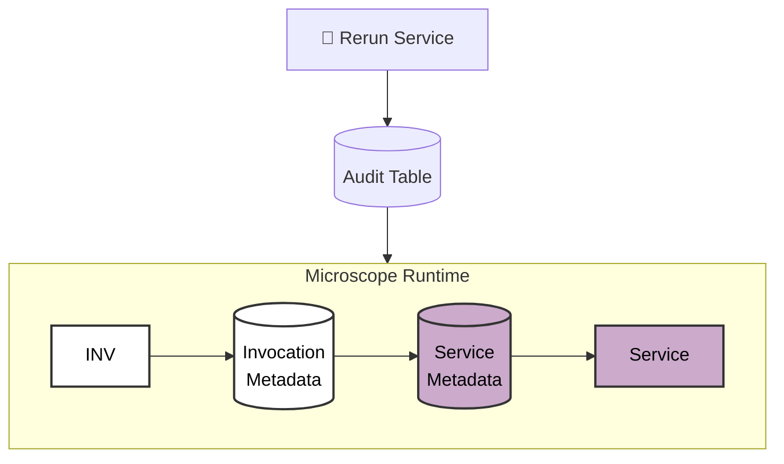

The Audit table also provides runtime benefits.

- Full Transaction Audit and error flagging performed in a common way across all business functions and all orgs allows error handling and alerting to be performed via a single mechanism and for tools to be written to enhance the error handling across all customers using the framework.

- Full **Linked Audit of Asynchronous events**. Each invocation is stamped with a unique id. If the invocation is asynchronous, that id is passed through to the Service implementation so that Service-side enrichment and output is linked back to the original invocation record in the Audit table.

- An alerting framework, for example one integrated with Slack, can be layered on top of Audit and triggered for defined subsets of records such as errors with specific error codes. 

Note that Auditing is optional in the framework and is controlled at the invocation level by the *Invocation CMT* records. High data volumes or sensitive data are examples that might lead teams to choose not to audit.

The details of the Audit process can be found [here](../docs/MicroscopeAudit.md)

#### Usage Analysis and Data Grounding

The single audit framework across the org provides a huge amount of information in a common format that can be ingested by data and visualizations platforms. For example uploads to Data 360 and CRM Analytics can be achieved using standard tooling and can power engagement analysis and click history for internal and external users across LWC and Flows. This can be used as input to Predictive AI functions and as grounding for Gen AI prompting.

Runtime Intelligence on Usage, Performance, Forensic and Trend intelligence can be made available in Data 360 or CRM Analytics for Business, Delivery, Operations and Security Teams at transactional and aggregates levels.

## Handling Functional Change

### Service-side Versions

Each of the Service-side CMTs (Service, Method, Implementation) in the Data Model has a version number field and different versions can exist concurrently at any of these levels. The semantics for the 3 version numbers are:

- **Service Version**: Any Service can be versioned. The *Service CMT* has only a small number of fields and is not versioned in the same way as Method and Implementation and is only mandated for large releases of functionality. Service versioning is best tied to namespaces. A Service Version and all its related artefacts (methods, implementations etc) can be deployed in a namespaced package. Artefacts like Apex class names can then be reused multiple times in different Serivce Versions within the same org. The Service Version should increment whenever a new namespace is used and the namespace ensures unique Fully Qualified Names.

- **Method Iteration**: The *Method Iteration CMT* specifies the method signature (the input and output). If the signature changes there should be a new iteration of the Method.

- **Implementation Version**: This increments when there is a change in an Implementation artefact for the same Method Iteration, the signature has not changed but the implementation has.

The framework promotes the use of new, concurrent *Implementation Versions* in preference to editing what is already deployed (a *No Edit principle*). An *Implementation Version* should be considered as immutable, they can be patched if an urgent fix is required but otherwise should not change, but be replaced with a new version when changes are required.

This is how change is typically implemented to provide small, fast, safe releases.

**1. Starting Position** - invocation points to Implementation *V1*, a predominantly self-contained flow or Apex class.

**2. Version Added** - Implementation *V2* is added, but the invocation does not need to adopt it immediately

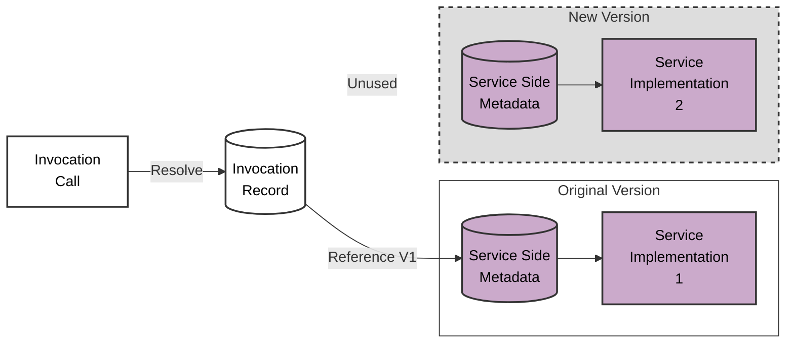

**3. Version Adopted** - Implementation *V2* is adopted but *V1* can remain, either for rollback assurance or if other invocations are still using it

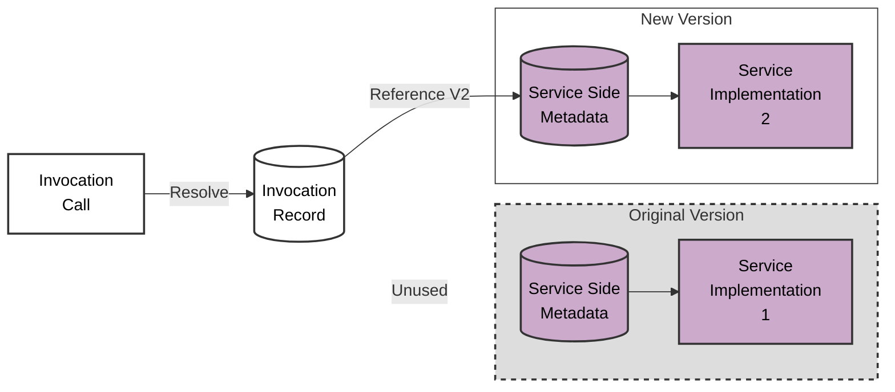

**4. End Position** - Implementation *V1* is removed when safe to do so

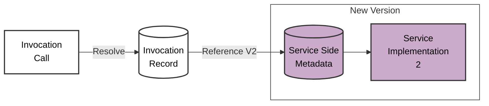

The *Invocation CMT* has references to the names and versions of Service-side CMTs. The team that owns an *Invocation CMT* record can switch to using a new combination of *Service Version*, *Method Iteration* or *Implementation Version* by updating these references. If a particular *Method Iteration* is invoked from multiple places, concurrent versions help to avoid the need for all of these to change their functionality at the same time. 

The ability to run concurrent Service-side Versions at various levels provides these benefits:

- **Concurrent Versions** : No Edit principle, with new self-contained versions rather than modifications to existing ones,, supporting concurrent live versions.

- **Feature Flagging** : Immediate deployment of Service-side versions with later activation (Service-side feature flagging).

- **Phased Version Adoption** : Service-side Versions prevent enforced simultaneous functionality change across the whole org when a service used by multiple parts of the business is upgraded.

- **Rollback** : Releases can be rolled back by reverting Invocation metadata records to point to previous versions. The older Service-side code and metadata can remain in the org until the new version has safely bedded in.

- **Minimized Build Dependencies**, Each *Invocation Call* should be referenced in **only one place in the build**. Referencing the same *Invocation Call* from multiple places would create an unnecessary link between those parts of the build - avoiding shared Invocation metadata record reduces dependencies and maximizes the ability to change functionality independently using metadata changes only, not code.

- **Build Hygiene** : Over time, an *Implementation Versions* may be superceded become obsolete, with no invocations calling it. Those that are no longer called can be recognised by running a simple report on the Invocation metadata records. The Service-side code artefacts and CMT records identified as redundant can then be removed.

- **Always use Latest Version** : Although we said earlier an *Invocation* must provide an *Implementation Version* value, this can be left blank. If so the runtime framework will choose the *Implementation CMT Record* with the highest *Implementation Version* for the *Method Iteration*.

To implement this pattern, you can either run the relevant AI skills or check out the documentation that comes with the skills.

* **Create a new Method Iteration**: [AI Skill](../skills/microscope-new-method-version/SKILL.md) | [Documentation](../skills/microscope-new-method-version/README.md)
* **Create a new Implementation Version**: [AI Skill](../skills/microscope-new-implementation-version/SKILL.md) | [Documentation](../skills/microscope-new-implementation-version/README.md)

### Invocation Permission-Based Processing

*(Different behavior for invocations for different users)*

As mentioned, calling applications invoke the framework by referencing an *Invocation Call*. This value should match the *Invocation Call* field of at least one *Invocation CMT* record. It may match more than one record because the *Invocation CMT* also has an optional field named *Invocation Permission*, which stores the API name of a Custom Permission. Records with this field populated are called **Permission Overrides**.

When an invocation is executed, the framework initially checks all Permission Override records with the referenced *Invocation Call* value.

- If the calling user has one of the referenced Custom Permissions assigned, the matching *Invocation CMT* record is used.

- If none of the populated *Invocation Permission* values match the user's permissions, the record with a blank *Invocation Permission* field is used. This is the *Default Invocation CMT Record*.

Together, the *Invocation Call* and *Invocation Permission* fields form a unique key for the Invocation CMT. The calling code references only the *Invocation Call* but not the *Invocation Permission*. This allows teams to change behavior for different user groups without changing the code.

The setup is simple:

- Create a new Custom Permission
- Assign that to a subset of users. To ensure consistency and clarity of behaviour make sure that no user is assigned more than one Custom Permission for any *Invocation Call*. 
- Add a new *Invocation CMT* record with this Custom Permission referenced in the *Invocation Permission* field.

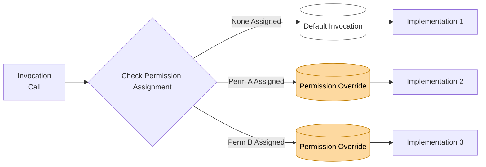

Invocation Permissions can be used for both temporary and permanent situations, from pilot implementations and hotfixes to regional variations or any other case where segmented groups of users need different processing.

#### Functional Pilots

Pilot runs of new Service-side Versions for subsets of users can be provided via *Invocation Permissions*. Teams develop the pilot implementation and when it is ready to deploy create a new custom permission and a new Permission Override CMT record that references the permission. The Override then routes the pilot users to the pilot implementation. If Invocation Permissions are already used to provide different functionality for different users, a second Invocation Permission layer may be required, and the field *Invocation Permission 2* can be used for this (see [Invocation Permission Selection](../docs/InvocationPermissionSelection.md)).

If the Pilot is successful, its *Invocation CMT* record can become the new default by clearing the *Invocation Permission* field and deleting the previous default record.

**How to Implement**: If you wish to implement this pattern, you can either run the relevant AI skill or check out the documentation that comes with the skill.

* **Create a Functional Pilot**: [AI Skill](../skills/microscope-new-pilot/SKILL.md) | [Documentation](../skills/microscope-new-pilot/DOCUMENTATION.md)

#### Segregated User Functionality

Invocation Permissions can be used to provide different long-term functionality for different user groups. For example, if users from different countries should use different pricing services, we can assign a custom permission to the designated users in each country, create Permission Override CMT records referencing each country permission, and route those users to the appropriate implementation.

If two levels of refinement are required, for example per country / per line of business, the *Invocation CMT* field **Invocation Permission 2** can be used. For the complete multi-permission selection process, see [Invocation Permission Selection](../docs/InvocationPermissionSelection.md).

#### Hotfixes

Emergency Hot Fixes can be tested by a small group of users assigned a specified custom permission prior to rolling out to the full user base. These can be considered as very quick, unscheduled pilots, and the steps are the same.

* Deploy a new Service-side Implementation Version record pointing to the fix implementation.
* Create a new *Permission Override* record with the same *Invocation Call* value which references a new Custom Permission and points to the new implementation. 
* Create and assign that permission to the team testing the fix

The hotfix can become the default live version by clearing the *Invocation Permission* field and removing the original *Default Invocation CMT* record.

Technically, segregated user functionality and hotfixes are identical to functional pilots, so the same implementation links apply.

## Operating in Different Contexts

Ideally, an agile enterprise will not have developers and testers always working in *full code* monolithic environments, but in smaller *partial* environments. The advantages are well understood but a number of challenges have to be addressed, principally concerning how to develop in environments where artefacts that will be called in production are not actually available or fully configured.

Further along the path to production, environments may have a full code base but data, or connections to external systems, are not complete or available. The behaviour in these environments is often different from production and this makes testing difficult.

Further challenges arise in production environments where different processing is required at different times, for example during a maintenance window or when a connection is unavailable.

### Stubs and Alternates

Microscope is designed to handle all these scenarios through the use of **Stub Patterns**. For each pattern we list which side the pattern is applied to (*Invocation* or *Service*), the environment type (*Partial Code* or *Full Code*), what level the stub is switched on at (e.g. by *Invocation Name*, *Invocation Call*, *Method*, *Service* ) and who needs to do the work to switch to stub processing.

#### Scratch Stubs

* Side: Invocation
* Environment: Partial Code
* Pattern Use Case: Early Development
* Maintained By: Invocation-Side Developers add Custom Setting in org
* Level: Invocation Name

Before a developer has a *real* implementation to work against she can define a simple **Scratch Stub** to use to make a quick start on building screens and processes. This pattern is used to provide a temporary stub implementation to allow development to proceed in the absence of a full implementation and is triggered entirely by a Custom Setting without any permanent metadata. 

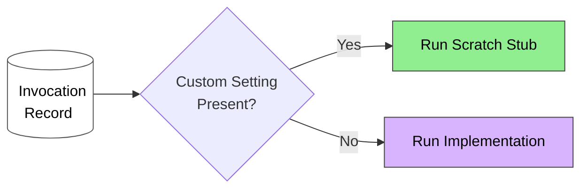

* **Setup a Scratch Stub**: You can use the [AI Skill](../skills/microscope-create-scratch-stub/SKILL.md) or create a stub by hand following the [Documentation](../skills/microscope-create-scratch-stub/README.md)

#### Absent Service Stubs

* Side: Invocation
* Environment: Partial Code
* Pattern Use Case: Build Separation, Agility, DX Development and Packaging
* Maintained By: *Invocation CMT* field and class maintained by Invocation-Side Developers.
* Level: The stub value is at the invocation level. Whether to use Absent Service Stub processing can be controlled at three levels of granularity — Org-wide, per Invocation Call, or per Invocation Name — using Environment Setting records. 

This is a more permanent metadata-based pattern for partial-code environments. A stub implementation is automatically called in place of the real implementation when the invocation's target *Service* is not present in the org. This is particularly useful in Scratch orgs and DX (unlocked) package development, for example in Scratch Stubs or Package development scenarios. Unlike *Scratch Stub* custom settings and classes these are, in essence, *part of the build* that always runs in partial environments when the target *Service* is absent.

* **Setup an Absent Service Stub**: These are configured once for an invocation and are pushed across environments. They are invoked by the absence of a *Service CMT* record. To implement either use the [AI Skill](../skills/microscope-create-absent-service-stub/SKILL.md) or create manually using the [Documentation](../skills/microscope-create-absent-service-stub/README.md)

The following diagram shows the stub flow for the Invocation side. Note that these take precedence over the Service-side stubs we'll see soon:

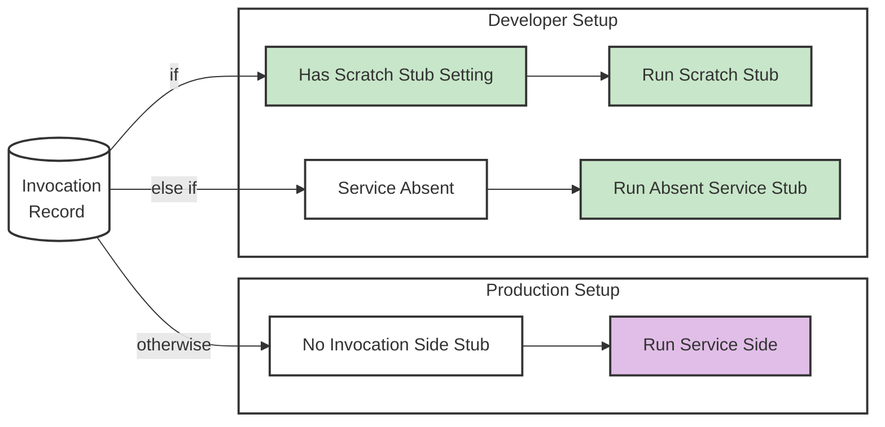

#### Absent Connection Stub
* Side: Service
* Environment: Full Code
* Pattern Use Case: Processing in test environments
* Maintained By: Service-side Developers write the stub, Environment Manager maintains Custom Settings
* Level: Custom setting at *Service* level, stubs defined at *Method Iteration* level.

When an integration, data grounding or LLM interaction is not available in a full code environment, **Absent Connection Stubs** provide an alternate implementation, switchable via a Custom Setting. The stub provides a well-formatted response to the Invocation side, allowing the Invocation side to function as it would in production even when the testing environment is not fully wired.

Absent Connection Stubs can also act as a **Facade to a Managed Package** that is hard to configure in test environments. In these cases all of the coded references to the managed package should be from Service Implementations. *Absent Connection Stubs* can run an alternative implementation of each method, by-passing the Managed Package altogether. 

Another key use case is to provide an alternative to calling a *Prompt Template* in non-production environments. This may be useful to provide output when there is no connected LLM, deterministic output for testing business processes or simple to save on *token consumption* in lower environments. 
 
**How to Implement**: If you wish to implement this pattern, you can either run the relevant AI skill or check out the documentation that comes with the skill.

* **Setup an Absent Connection Stub**: [AI Skill](../skills/microscope-create-absent-connection-stub/SKILL.md) | [Documentation](../skills/microscope-create-absent-connection-stub/README.md)

#### Consistent Unit Tests

* Side: Invocation
* Environment: All
* Pattern Use Case: Consistent Unit Tests
* Maintained By: Invocation-Side Developers add Custom Settings in test setup
* Level: As per pattern (Scratch Stubs and Absent Connection Stubs)

We can think of Unit testing as a partial environment. It takes place in a modified runtime with greatly limited access to records and no external systems available. 

*Scratch Stubs* can be invoked in unit tests to provide **consistent test execution** from scratch / partial org development through to production. Inserting a *Scratch Stub custom setting* in the test setup forces a uniform behaviour for an invocation regardless of the configuration of the test environment.

Unit tests should not use *Absent Service Stubs*. 
If the target Service is present in a higher environment the *Absent Service Stub* custom setting will be ignored at runtime and in unit tests, so testing outcomes might be different in partial-code and full-code orgs.

*Absent Connection Stubs* can help in unit tests that, for example, cover code running integrations or interfaces to an LLM. Development teams often implement mocking processing in code to test these elements. This approach avoids that complexity, is more visible and controllable in configuration, and completely avoids *Test.isRunningTest()* switches hidden in code.

A key principle of Unit Testing is that each test method should be targetted to validate just one thing. Decoupling the Service Side provides clear and granular scope for testing the Invocation Side and the Service Side independently.

#### Alternate Processing when External is Down
* Side: Service
* Environment: Full Code
* Pattern Use Case: Graceful processing in production environments when connections are down or during maintenance windows.
* Maintained By: Service-side Developers write the stub, Environment Manager maintains Custom Settings
* Level: Service

A **Down Status Stub** is used in production environments to provide alternative processing when a Service is unavailable. Stub processing can be triggered in two ways
1. An Administrator can create the Custom Setting to switch functionality. 
2. Implementations can also **programmatically** set a Service to be Down based on data in service responses. 

As mentioned, the primary use cases are to handle scheduled maintenance windows and graceful handling of outages. However there are others:

* A Down Status Stub can also work as a safety mechanism when an LLM interaction needs to be shut down for toxicity or legal reasons. 
* They can be coded to capture all outbound call data whilst the connection is down, to **prevent potential data loss**. Failed invocations can also potentially be rerun from the Audit tables as requiredonce the service is resumed.

**How to Implement**: If you wish to implement this pattern, you can either run the relevant AI skill or check out the documentation that comes with the skill.

* **Setup a Down Status Stub**: [AI Skill](../skills/microscope-create-down-status-stub/SKILL.md) | [Documentation](../skills/microscope-create-down-status-stub/README.md)

#### Order of Priority 

This is the Processing Order when an Invocation is run, should any stubs or overrides be configured.

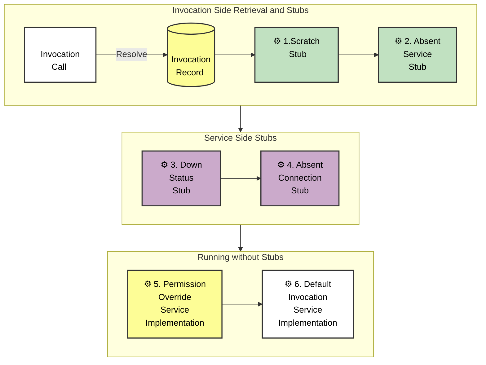

### Security Benefits

Microscope provides permission-based and context-based mechanisms to restrict when and by whom an Invocation can be run. See [Microscope Security](../docs/MicroscopeSecurity.md) for the full details, including quiddity reference tables, unit test exemptions, and guidance on exposing invocations to external systems.

## Generative AI Benefits

This framework provides several benefits for calling Generative AI features from the core Salesforce platform.

### Gen AI Testing and Delivery

The architecture can help test generative AI processes within the Enterprise. 

#### Grounding for Testing

Prompt Templates are often grounded with data from the org, from *Data 360* or connected external systems, but in development and test orgs that data may not be available or rich enough to support realistic testing. Prompt quality may therefore be hard to evaluate. If the org does not have the data required for the retrieval part of a process, production-like data can be provided by an alternate implementation. 

The diagram below illustrates an implementation of a grounding retrieval for a Prompt Template which has a stub option (a *Scratch Stub* or *Absent Service Stub*). The stub can be used to provide production-like grounding in partial code and partial data development and testing contexts.

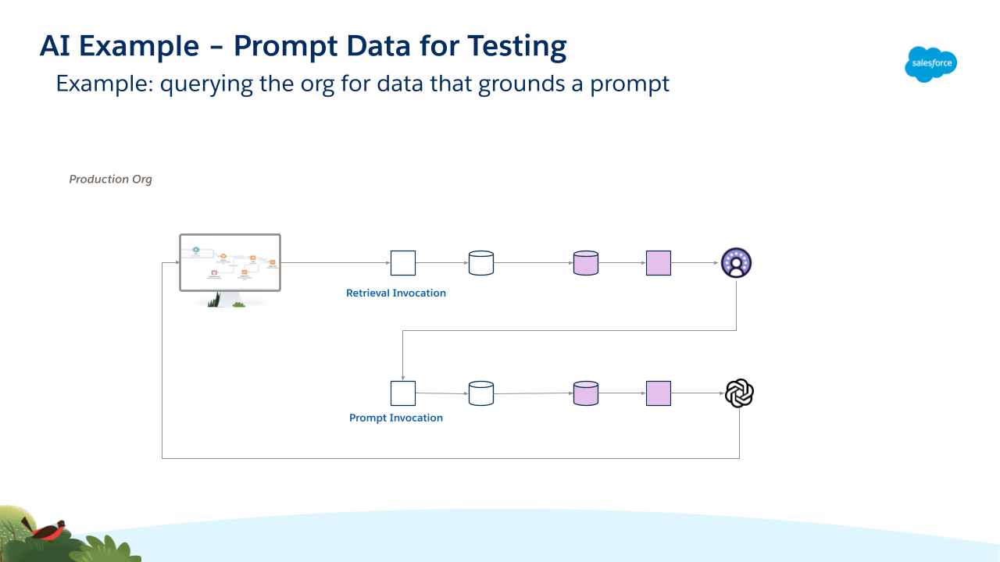

#### Deterministic Responses for Testing

The non-deterministic nature of LLMs also makes business processes harder to validate because traditional "expected vs actual" pattern-matching is no longer sufficient. Sometimes teams want to test the process, not the LLM response. If **deterministic output** is needed for business-process testing, an alternate implementation can replace the variable LLM response by use of an *Absent Connection Stub*.

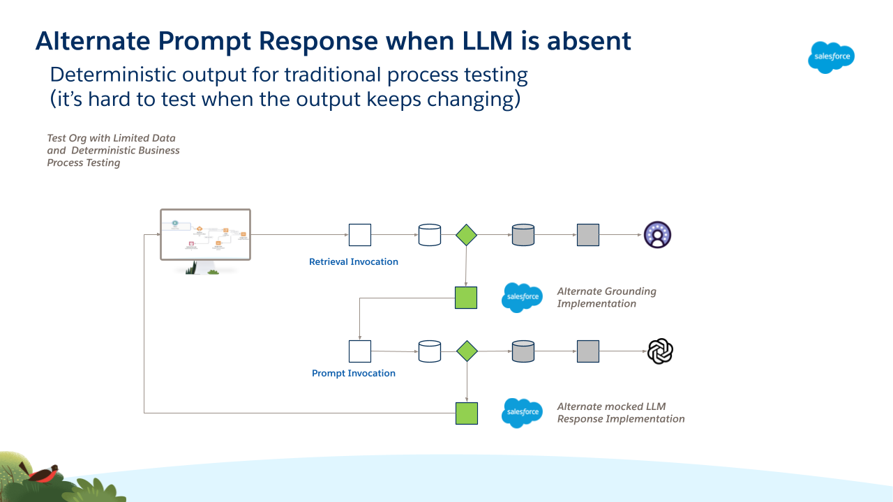

Note that using this technique can also **reduce token consumption** in test environments, with a material cost saving for the Enterprise.

#### Prompt Service

This solution runs Prompt Templates in Apex through a dedicated **Prompt Service**, rather than calling them directly from Agentforce Actions or Flows.

The flow is simple:

1. The caller references an *Invocation Call*.
2. The *Invocation CMT* record identifies which Prompt Template should be used.
3. That Invocation points to a reusable Method on the Prompt Service.
4. The Prompt Service runs the configured template.

For example, an Agentforce Action can call a reusable Apex Action that references an *Invocation Call*. A Flow can use the same pattern. This gives Prompt Templates the same governance, auditing, failover, and environment controls as any other service.

**How to Implement**: If you wish to implement this pattern, you can either run the relevant AI skill or check out the documentation that comes with the skill.

* **Refactor an Agentforce Apex Action**: [AI Skill](../skills/microscope-refactor-invocable-action-apex/SKILL.md) | [Documentation](../skills/microscope-refactor-invocable-action-apex/README.md)

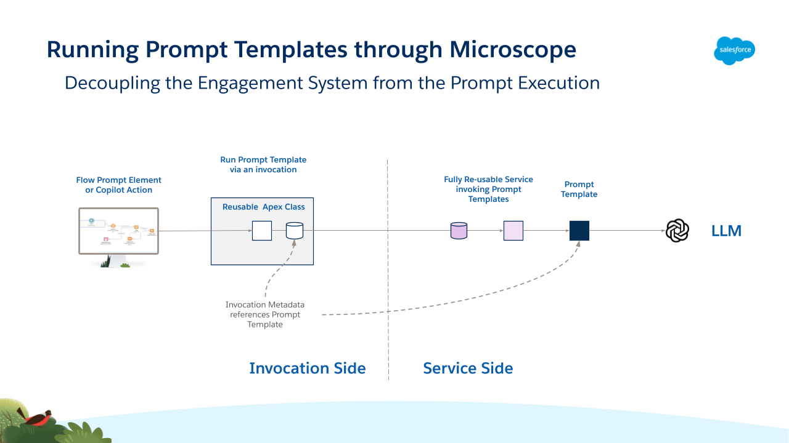

#### Generative AI Governance and Security

All of the framework features for Security, Runtime, Governance, Release and Environment Management and Analysis are accessible via this mechanism.

#### Generative AI Prompt Safety Data Auditing

The framework can be configured to automatically create Audit records. For Prompt Templates, those records can also include Trust Layer-enhanced information about the health of the response and how toxic, abusive, or biased it might be, in addition to the user context, input, and output.

- Benefit (Generative AI Prompt Safety) : Real-time, realtime, in-context storage of Einstein Trust Layer scores against individual calls to LLMs inside the org. Flow and Apex triggers can act on these and Administrators can report on these records.

#### Generative AI Prompt Change Management

Because test environments may be limited both in data richness and system integrations, and because some businesses need to change Prompts very quickly, prompts may need to be tested in production environments within some Enterprises. Invocation Permission-Based Variants can be used to make those upgrades safer.

If a Prompt Template is live and a new version has been written, Enterprises typically upgrade the prompt in situ for all users. Without user testing, this risks making the service worse for at least some users.

Using Invocation Permissions, the process is as follows:

1.  Permission Overrides can be deployed alongside the default Invocation Metadata for the call to the Prompt Template. The override is identical to the default except that it references a (short-lived) Invocation Permission and references the newer Prompt Template.

2.  A group of Pilot Users is assigned the Invocation Permission and these will run the newer version of the Prompt Template. The majority of users without the permission continue to use the older version.

3.  When the pilot is deemed successful, the Invocation Permission and the Permission Override  record are removed and the default *Invocation CMT* record is altered to reference the newer Prompt Template.

Benefits include:

- Benefit (A/B Testing and Safe Upgrades of LLM interactions) : Groups of users assigned a Custom Permission can be pointed to updated Prompt Templates, while those without the permission continue to use the default template. Once all users have the permission, the default changes to the new template and the permission is removed.

#### Generative AI Role-Based Processing

Prompt Templates and Agentforce Actions provide a single implementation for all users in an org. Users from different roles, divisions or countries in an Enterprise can require both custom prompts and custom grounding for those prompts.

Using Permission Overrides for an Invocation Call that uses the Prompt Service, and assigning different custom permissions to groups of users, can run different Prompt Templates for them.

The example below shows a scenario with specific custom permissions for users in Spain and Germany, with users from those countries taken to their own specific prompt templates via Permission Overrides, shown in yellow. All other users, who do not have either permission, are routed via the default Invocation metadata record to an implementation which in this example does not interface to an LLM.

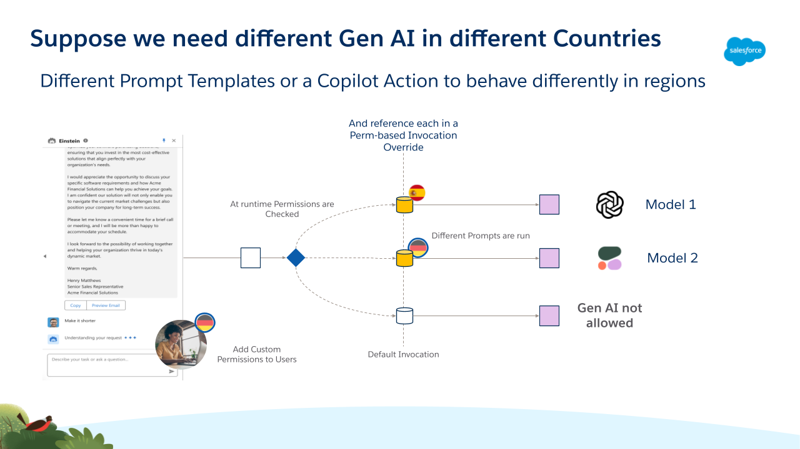

- Benefit (Generative AI Role-Based) : Allow different LLMs (or no LLM) to be used in different jurisdictions to conform to regional legislation.

- Benefit (Generative AI Role-Based) : Agentforce Actions and Prompt Templates can run different implementations dynamically for different groups of users, based on job role, region or other business-meaningful criteria.

#### Generative AI Prompt Safety

Enterprises must protect their users and customers from unexpected or toxic responses from models. The Einstein Trust Layer calculates a safety score for every run of a Prompt Template which can be used to provide a range of protective functionalities.

The functionality is configurable in three main ways:

##### 1. Threshold-based responses

The Prompt Service can be configured by the admin with three decimal-valued environment parameters between 0 and 1. These thresholds determine what should happen when a Prompt Template returns a Safety Score.

  1.  *PromptFatalThreshold* - A Safety Score less than this value will cause a Method Alternate to run and block future attempts to run this Prompt Template. The Prompt Service creates a Custom Setting record programmatically which is checked by all future runs and, if found, directs processing to a Down Alternate. The block can be cleared by an Admin by removing the Custom Setting record.

  2.  *PromptErrorThreshold* - A Safety Score less than this value (but \> *PromptFatalThreshold*) will cause a Method Alternate to run but the Prompt Template remains accessible to future calls.

  3.  *PromptWarnThreshold* - A Safety Score less than this value will return the LLM response to the end user, however the Audit Record created will include an Error Code indicating that a suboptimal response was returned by the model. Note that *PromptWarnThreshold* \> *PromptErrorThreshold*.

##### 2. Prompt failover

Each Invocation that calls the Prompt Service can be configured to fail over. In this scenario, more than one Prompt Template is specified in the *Invocation CMT* record. The Prompt Templates are run in sequence until one returns a Safety Score higher than *PromptErrorThreshold*. The configured list may include prompts that call different models, increasing the chance that at least one template is safe at runtime.

##### 3. Prompt selection strategy

When an Invocation is configured for failover, the framework can also choose the order in which templates should run. The available algorithms are:

  1.  “Given Order” - Prompt Templates are run in the order they are listed in the Invocation Metadata configuration.

  2.  “Recent Safest” - A query is run against the Audit table calculating the mean Safety scores of recent runs of the configured Prompt Templates. The templates are then run in the returned order (safest first).

  3.  “Run All Return Safest” - all of the configured templates are run and the response from the template with the safest score is returned to the caller.

The first diagram shows two runs when the *Prompt Service* is not configured to Failover. In the first case a safe response is received (Safety \> *PromptWarnThreshold*), followed by a run where an unsafe response (Safety \< *PromptErrorThreshold*) is returned by the model.

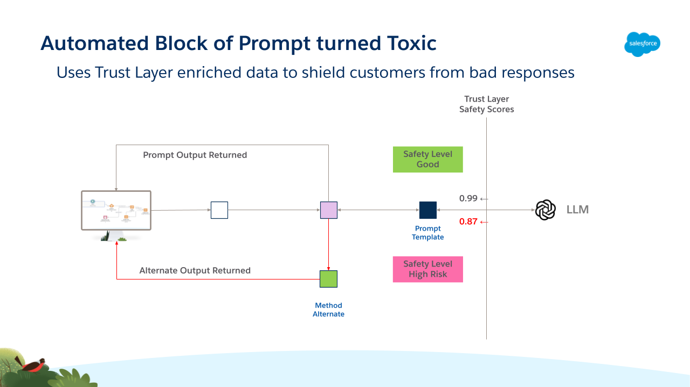

The next diagram shows an Invocation configured to Failover with two Prompt Templates specified. It shows the functioning when an unsafe LLM response is received by the first template and the second is run as a failover.

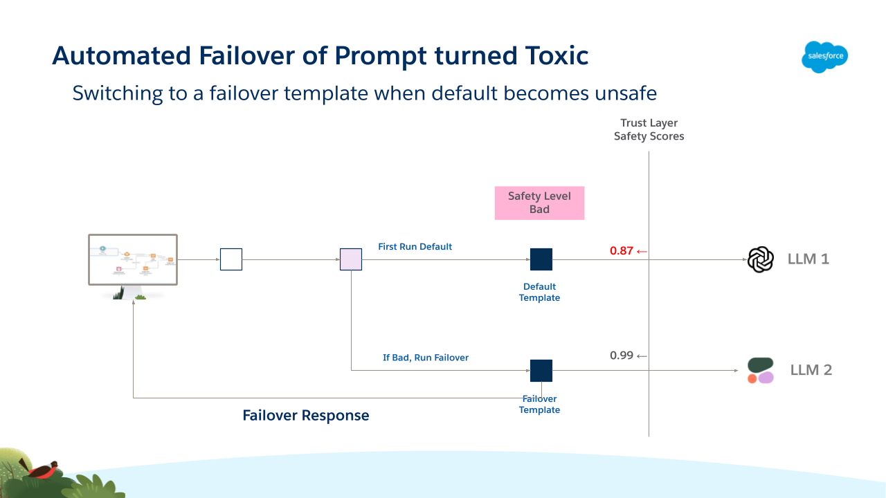

The next diagram shows the functionality when an invocation is configured to return the Recent Safest Prompt Template from a list.

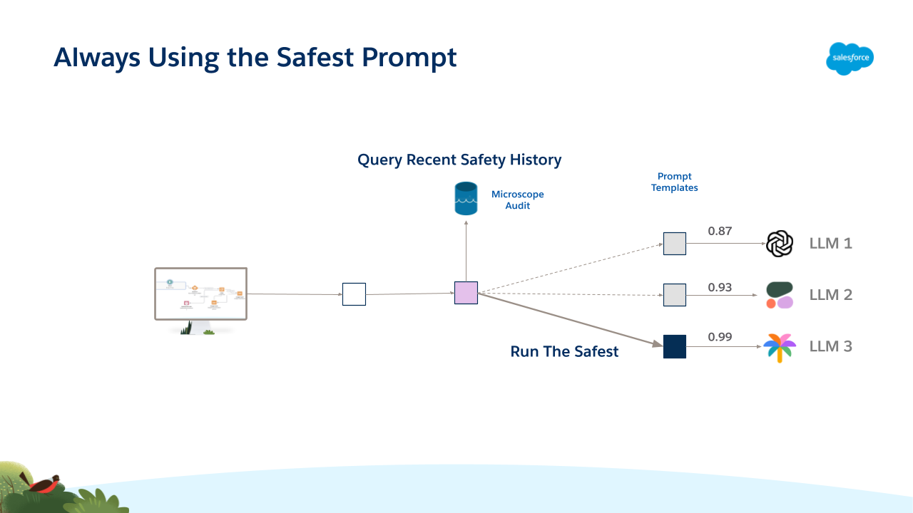

Benefits include:

- Benefit (Generative AI Prompt Safety - Redaction) : If the response from a LLM for a Prompt Template has an unacceptable Einstein Trust Layer Safety Score, run alternate code to return a non-generative response to the end user.

- Benefit (Generative AI Prompt Safety - Failover) : Configure a group of prompt templates with similar functional definitions and run these in order, returning the output of the first that returns an acceptable Einstein Trust Layer Safety Score.

- Benefit (Generative AI Prompt Safety - Blocking) : Temporarily block future runs of any Prompt Template that achieves a low Einstein Trust Layer Safety Score on a single run.

- Benefit (Generative AI Prompt Safety - Recent Safest) : Configure a group of prompt templates with similar functional definitions and run the one with the best Einstein Trust Layer Safety Scores based on recent runs.

- Benefit (Generative AI Prompt Safety - Use Safest) : Configure a group of prompt templates, run each and use the output with the best Safety score as computed by the Einstein Trust Layer.

