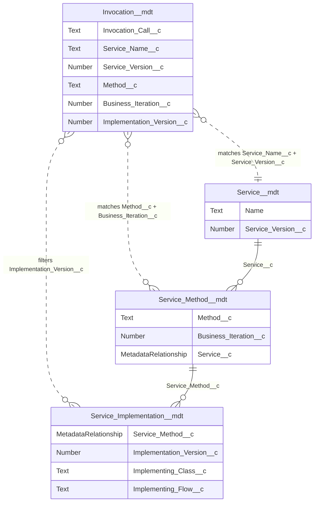

# microscope-new-apex-invocation: Setup a new Service Invocation

## Mapping Invocations to the Services Data Model

A Service Invocation is a **Invocation CMT Record** which represents a call by a consumer of a service, like an LWC controller, an Omniscript or a Flow. It needs to identify which method *and* version of a Service it wishes to invoke, but does not need to know how this is implemented.

It has two identifying fields and two levels of versioning with their own semantics that map to the above concepts. These are:

* Service Name: name of the Service which hosts the method which we are looking to invoke. Note that we configure this as the Service name rather than a lookup as the Service may not be configured in all environments, for example scratch orgs which do not have the full build, in which case a stub method should be used as an override.
* Method Name: a business logical method name.
* Business Iteration: used to identify the correct *Method Iteration* for the invoked call. There is a new iteration of a method every time the signature changes.
* Implementation Version: identifies a specific technical implementation of the *Method Iteration*. This can be left blank, in which case the runtime framework will choose the *Implementation CMT Record* with the highest *Implementation Version* for the *Method Iteration*.

These fields relate to the 3 level data model of Custom Metadata Types (CMTs) on the Service-side. The following shows the relationships, albeit in a simplified model with a number of fields not shown for clarity. The dotted arrow lines highlight the links between invocation fields and service-side fields but these are not lookups in the data model.

### Microscope Invocation Side Relationships ERD

The dotted arrow lines highlight the links between invocation fields and service-side fields but these are not lookups in the data model. It is fundamental to our model that whilst the invocation side references the Service and method names *there are no lookups between the two sides*, they are fully **decoupled**. This is crucial for packaging and working in partial code environments. 

The Service-side chain is anchored by the actual metadata relationships `Service_Method__mdt.Service__c` and `Service_Implementation__mdt.Service_Method__c`.

## About the Skill

In your AI Code Generator terminal ask the tool to "run the Instructions for the AI Code Generator in the file skills/microscope-new-apex-invocation/SKILL.md to setup a new Service invocation in this code base.". Reference the relative path to the file in the project structure if required. Be attentive to answer the resulting questions accurately.

## Testing

Test this using these answers to the questions from the AI Code Generation Tool

- The Service is called Payment and the method is takePayment.
- Two input parameters: invoiceNumber (String) and amount (Decimal).
- Yes, please use your suggested base folder for invocations metadata.
- Provide `mscope` as the namespace.
