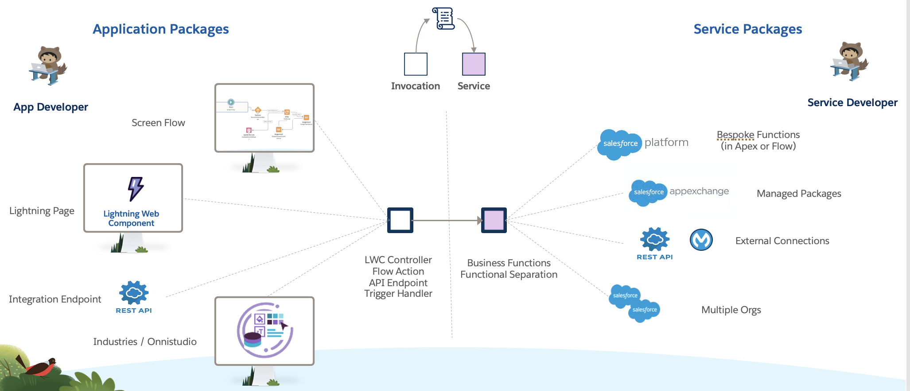
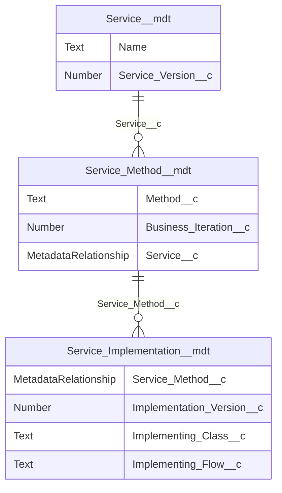

# microscope-new-method-setup: Setup a new Service method

In *Microscope*, a **Service** represents a collection of related **methods** that implement specific, related functionality. The methods give callers access to business functionality and all interfacing to this functionlity, at a code or process level, is via these methods. 

A Service might be for example: 
* a set of business functionality implemented in the org, like a *Pricing Service*, with the methods being ways a caller might get information like *getPrice*
* an abstraction of an external system, for example a facade for a service for current foreign exchange rates with method like *getRate('USD','GBP')*
* an internal shared process, like an *Audit Service*, with methods for logging audit information.

The teams that own the service functionally define, design and implement the methods without having to share these details beyond the definition of the service methods.

Multiple versions of Service methods are supported to allow for controlled change. An **invocation** (a consumer of a service, like an LWC component, an Omniscript or a Flow) will need to decide which method *and* version it wishes to invoke, but does not need to know how this is implemented. Many versions of the method can be available at any point in time which means that any new requirement for a service for one particular business case does not have to be immediately adopted by all parties, which removes the need for synchronized change across the org. 

### Defining Services

Each Service is represented by a  **Service CMT Record** and also by a companion **Service Runtime Custom Setting**. The CMT Record records the permanent attributes of the service, like the logical package it is part of, and is only updated as part of deployments. The custom setting has a field called *Status Override* which tells *Microscope* the status of this service at the current time in this environment. This can be:

* Active - the business functionality is available 
* Stubbed - the full service is not available and methods might be stubbed (for example if the Service is a facade for an integration that is not available in the current environment). See [Absent Connection Stubs](../microscope-create-absent-connection-stub/README.md) for more information.
* Down - the Service has issues and calls are redirected to other methods gracefully. See [Down Status stubs](../microscope-create-down-status-stub/README.md) for more information.

So the status of the service can change across environments (Stubbed / Not Stubbed) and over time (Active / Down) within the same environment, but without needing to change the custom metadata.

### Methods and Signature Versions

A **Method Iteration CMT Record** has these properties that form a Unique Key:  

* It references a *Service CMT*
* A business-logical method name
* Has potentially many **Business Iteration** over time. We can think of each Business Iteration as a **Functional Version** of the method. The framwork a new iteration of a method *every time the method signature changes. The rule of thumb is that if a method changes its signature it is also changing its functionality - if the input or output changes then we need a new functional version / iteration. 
* An Input and Output Definition – the name of an Apex class, interface, literal or SObject for each of the input and output definitions of this method.  

### Implementations and Implementation Versions

A **Service Implementation CMT Record** is also a CMT Record and it represents the implementation of a Signature Version of a Method Iteration. It has these basic properties:  

* It has a lookup to a *Method Iteration CMT* (so has an assocation to a Service, Method and Signature Version). We can have many implementation records associated to one Method Iteration at any one time, but as the method and Signature Version prescribe input and output structures these implementations all have the same functional shape.
* It has a numeric Implementation Version that increases over time.
* It has one of the following populated
    * Implementing Class – an Apex Class that implements the service method functionality. 
    * Implementing Flow – a Flow that implements the required functionality.

### Microscope Service Side Relationships ERD

# About the Skill

In your AI Code Generator terminal ask the tool to "run the Instructions for the AI Code Generator in the file skills/microscope-new-method-setup/SKILL.md to setup a new Service method in this code base.". Reference the relative path to the file in the project structure if required. Be attentive to answer the resulting questions accurately.

## Testing

Test this using these answers to the questions from the AI Code Generation Tool

- The Service is called Payment and is for handling the processing of payments. The method is to take payments from customers.
- Two input parameters invoiceNumber which is string and amount which is the payment amount (currency).
- The output should be a confirmation message that the payment has been processed or an error if the payment has failed.
- Yes, please use your suggested base folder for services metadata.
