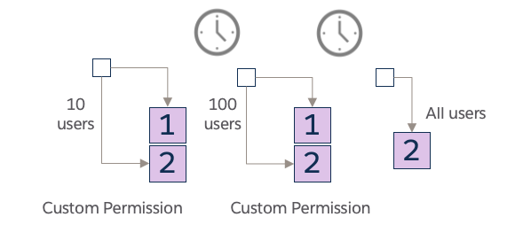
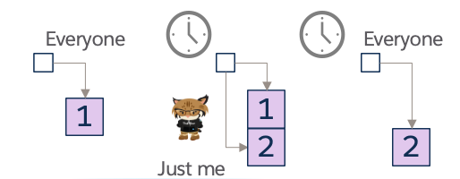

# Invocation Pilots

**Invocation Pilots** are provided by *Microscope* to support temporary fixtures in test or production environments, where different processing is required for a subset of users for a short period. This might be to facilitate one of many real-world scenarios we see in enterprise orgs:

* to *pilot functioality in an org* for a subset of users. 
* *smoke testing* prior to an emergency *hot-fix* when a bug is hitting production. 
* to handle an urgent business change. 

**Pilot Invocation Custom Metadata Type Records** are used to provide temporary alternative configuration values for a given invocation. These pilot records share the same underlying *Invocation Call* as the original invocation but route a specific subset of users to different functionality. Once the configuration has been read, the processing is exactly the same as the normal scenario.

A Pilot Invocation record contains fields that specify how the pilot operates:

* **Invocation Call**: Must exactly match the *Invocation Call* of the original Invocation record that we are attempting to override.
* **Invocation Metadata Type**: Must be set to `Permission Override`.
* **Invocation Permission**: API name of a Custom Permission that is granted to certain users. If a user is granted this permission, this pilot invocation record will be used in preference to the parent Invocation record.
* **Implementation Version**: Points to the new implementation version that the pilot users should run.

We can associate multiple *Pilot Invocation* records to a single original *Invocation* by matching the *Invocation Call*. This allows different functionality to be picked up by different sets of users. 

When calling an invocation, *Microscope* processes these records to determine which one should be used:

1. It checks for pilot records with a matching *Invocation Call* and an *Invocation Metadata Type* of `Permission Override`.
2. The *Invocation Permission* value is checked to see if it matches the name of a Custom Permission assigned to the running user. If so, this matching Pilot Invocation is used.
3. Otherwise, if no pilot custom permissions match the current user, the standard *Invocation* record is used.

This mechanism allows us to easily implement gradual adoption strategies based on user permissions.

## Setting up a Pilot

There are a few simple steps to set up a pilot:

1. Create a Custom Permission.
2. Create your new service method implementation version (Apex class or flow) to act as the pilot functionality.
3. Create the **Pilot Invocation** metadata record:
   - Use the same *Invocation Call* as the original record.
   - Set *Invocation Metadata Type* to `Permission Override`.
   - Set *Invocation Permission* to the Custom Permission created in step 1.
   - Set *Implementation Version* (and related service fields) to the new implementation.
4. Add the Custom Permission to a Permission Set / Permission Set Group.
5. Assign the Permission Set / Group to your pilot users.

### AI Pilot Generation

If you are using AI coding tools, there is a dedicated skill available to automate the creation of a pilot. This skill instructs the AI to automatically generate the new Implementation Version, the Custom Permission, and the Pilot Invocation metadata record based on an existing Invocation. 

You can find and invoke this skill here: [AI Code Gen Pilot Skill](../../../../skills/microscope-new-pilot/SKILL.md).

## Use Case Examples

### Gradual Rollout of a new feature

Suppose a Quoting Service calls a Pricing Service, and you want to deploy a new Pricing Service update to just 100 users out of 10,000 for a pilot. You don't want to change the Quoting Service code, but you want to ensure the new pricing logic can be rolled back immediately if issues arise.

To solve this, create a new Implementation Version of the Pricing service method and a new Custom Permission. Then, create a Pilot Invocation record for the caller that specifies this new custom permission and points to the new Pricing Service implementation. Add the Custom Permission to the 100 pilot users.

The majority of users without the Custom Permission will continue using the previous implementation. Once confident in the pilot:

* Update the standard *Invocation* record to point to the new implementation.
* Delete the Pilot Invocation record and the Custom Permission.

If the pilot fails, deleting the Pilot Invocation immediately restores the previous state.

### Smoke Test and Hot Fix

After deploying a new service implementation, you can create a Pilot Invocation restricted by a Custom Permission granted only to testers. This allows them to validate the deployment in production without affecting regular users. Once verified, update the main Invocation record and remove the pilot. 

Hot fixes follow the same process: apply the fix via a Pilot Invocation for a small group or testing team. Once confirmed, flip the main invocation to the hot fix version and remove the pilot invocation and previous implementation.

### Pilots and Business Mergers

Pilots can handle business mergers where acquired users need their existing legacy processes (like a separate pricing service). If the method signatures align, acquired users can run in a pilot mode using their legacy service implementation before fully transitioning to the common service.

### Notes

* If there is a **permanent** need for different users to experience different behaviours, handle this in the invoking code or logic rather than using Pilot Invocations, which are intended for temporary or transitional states.
