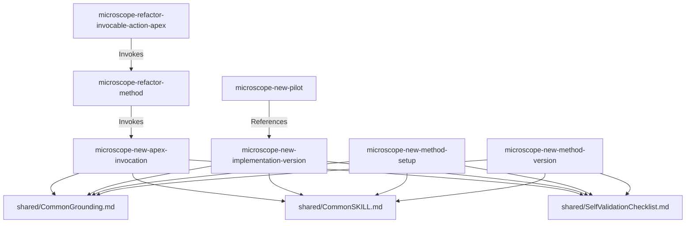

# Skill Dependencies

This diagram maps the dependencies between the skills in the `/skills` folder based on which skills reference others in their `SKILL.md` files.

```mermaid
graph TD
    %% Skills
    NAI["microscope-new-apex-invocation"]
    NIV["microscope-new-implementation-version"]
    NMS["microscope-new-method-setup"]
    NMV["microscope-new-method-version"]
    NP["microscope-new-pilot"]
    RIA["microscope-refactor-invocable-action-apex"]
    RM["microscope-refactor-method"]

    %% Shared resources
    CG["shared/CommonGrounding.md"]
    CS["shared/CommonSKILL.md"]
    SVC["shared/SelfValidationChecklist.md"]

    %% Skill to Skill dependencies
    NP -->|References| NIV
    RIA -->|Invokes| RM
    RM -->|Invokes| NAI

    %% Skill to Shared dependencies
    NAI --> CG
    NAI --> CS
    NAI --> SVC

    NIV --> CG
    NIV --> CS
    NIV --> SVC

    NMS --> CG
    NMS --> CS
    NMS --> SVC

    NMV --> CG
    NMV --> CS
    NMV --> SVC
```
